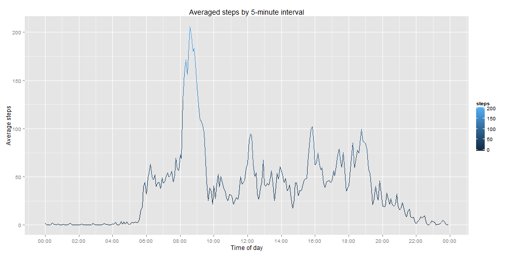
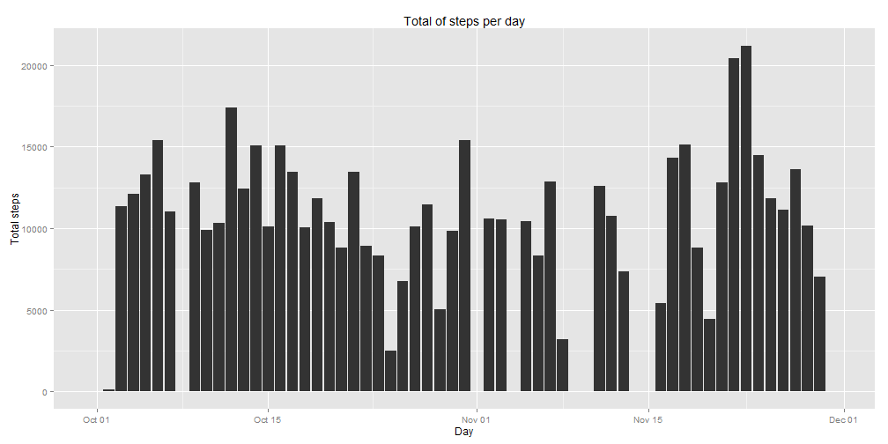
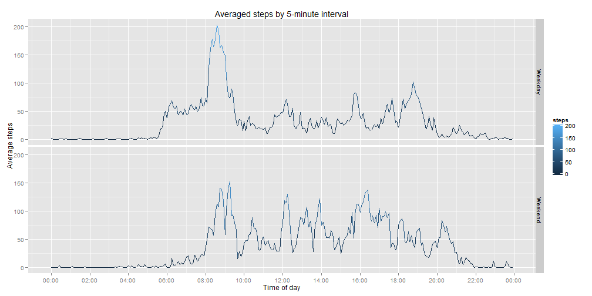

## Loading and preprocessing the data

The first step for this project is to load the data completely in r. Due to the fact the data is in a zip file, the first step is to read this data, without having to unzip it first:


```r
setwd("~/Respaldo/Archivos_Git/RepData_PeerAssessment1")
step <-read.csv(unz("activity.zip", "activity.csv"), stringsAsFactors = FALSE)
```

Now, we need to change the dates and times to an appropriate format:


```r
Sys.setlocale("LC_TIME", "English")
```

```
## [1] "English_United States.1252"
```

```r
step$interval <- sprintf("%04d", step$interval)
step$datetime <- paste(step$date, step$interval)
step$datetime <- strptime(step$datetime, format = "%Y-%m-%d %H%M")
```

We're all set to start the analysis.

## What is mean total number of steps taken per day?

1. The *mean* value per day is computed with this code.


```r
aggregate(steps ~ date, data = step, mean)
```

```
##          date   steps
## 1  2012-10-02  0.4375
## 2  2012-10-03 39.4167
## 3  2012-10-04 42.0694
## 4  2012-10-05 46.1597
## 5  2012-10-06 53.5417
## 6  2012-10-07 38.2465
## 7  2012-10-09 44.4826
## 8  2012-10-10 34.3750
## 9  2012-10-11 35.7778
## 10 2012-10-12 60.3542
## 11 2012-10-13 43.1458
## 12 2012-10-14 52.4236
## 13 2012-10-15 35.2049
## 14 2012-10-16 52.3750
## 15 2012-10-17 46.7083
## 16 2012-10-18 34.9167
## 17 2012-10-19 41.0729
## 18 2012-10-20 36.0938
## 19 2012-10-21 30.6285
## 20 2012-10-22 46.7361
## 21 2012-10-23 30.9653
## 22 2012-10-24 29.0104
## 23 2012-10-25  8.6528
## 24 2012-10-26 23.5347
## 25 2012-10-27 35.1354
## 26 2012-10-28 39.7847
## 27 2012-10-29 17.4236
## 28 2012-10-30 34.0938
## 29 2012-10-31 53.5208
## 30 2012-11-02 36.8056
## 31 2012-11-03 36.7049
## 32 2012-11-05 36.2465
## 33 2012-11-06 28.9375
## 34 2012-11-07 44.7326
## 35 2012-11-08 11.1771
## 36 2012-11-11 43.7778
## 37 2012-11-12 37.3785
## 38 2012-11-13 25.4722
## 39 2012-11-15  0.1424
## 40 2012-11-16 18.8924
## 41 2012-11-17 49.7882
## 42 2012-11-18 52.4653
## 43 2012-11-19 30.6979
## 44 2012-11-20 15.5278
## 45 2012-11-21 44.3993
## 46 2012-11-22 70.9271
## 47 2012-11-23 73.5903
## 48 2012-11-24 50.2708
## 49 2012-11-25 41.0903
## 50 2012-11-26 38.7569
## 51 2012-11-27 47.3819
## 52 2012-11-28 35.3576
## 53 2012-11-29 24.4688
```

2. The *median* per day is calculated with this code.


```r
aggregate(steps ~ date, data = step, median)
```

```
##          date steps
## 1  2012-10-02     0
## 2  2012-10-03     0
## 3  2012-10-04     0
## 4  2012-10-05     0
## 5  2012-10-06     0
## 6  2012-10-07     0
## 7  2012-10-09     0
## 8  2012-10-10     0
## 9  2012-10-11     0
## 10 2012-10-12     0
## 11 2012-10-13     0
## 12 2012-10-14     0
## 13 2012-10-15     0
## 14 2012-10-16     0
## 15 2012-10-17     0
## 16 2012-10-18     0
## 17 2012-10-19     0
## 18 2012-10-20     0
## 19 2012-10-21     0
## 20 2012-10-22     0
## 21 2012-10-23     0
## 22 2012-10-24     0
## 23 2012-10-25     0
## 24 2012-10-26     0
## 25 2012-10-27     0
## 26 2012-10-28     0
## 27 2012-10-29     0
## 28 2012-10-30     0
## 29 2012-10-31     0
## 30 2012-11-02     0
## 31 2012-11-03     0
## 32 2012-11-05     0
## 33 2012-11-06     0
## 34 2012-11-07     0
## 35 2012-11-08     0
## 36 2012-11-11     0
## 37 2012-11-12     0
## 38 2012-11-13     0
## 39 2012-11-15     0
## 40 2012-11-16     0
## 41 2012-11-17     0
## 42 2012-11-18     0
## 43 2012-11-19     0
## 44 2012-11-20     0
## 45 2012-11-21     0
## 46 2012-11-22     0
## 47 2012-11-23     0
## 48 2012-11-24     0
## 49 2012-11-25     0
## 50 2012-11-26     0
## 51 2012-11-27     0
## 52 2012-11-28     0
## 53 2012-11-29     0
```

Not every day has a mean and median due to *missing values*

## What is the average daily activity pattern?

To answer this question, first we will look at the **averaged graph per 5-minute interval** trough all the days. This can be computed by doing:


```r
stept <- aggregate(steps ~ interval, data = step, mean)
```

The graph is drawn by using the `ggplot2` library.


```r
library(ggplot2)
library(scales)
g <- ggplot(stept, aes(as.POSIXct(interval, format ="%H%M"), steps))
g + geom_line(aes(colour = steps)) + scale_x_datetime(breaks = "2 hour", labels = date_format("%H:%M")) + ggtitle("Averaged steps by 5-minute interval") + xlab("Time of day") + ylab("Average steps")
```

 

The second question is answered by using `which.max` in the data frame created for the graph. We can estimate it at around 8 or 9 AM, though we can have a better answer by doing:


```r
library(lubridate)
h <- hour(strptime(stept$interval[which.max(stept$steps)], format = "%H%M"))
min <- minute(strptime(stept$interval[which.max(stept$steps)], format = "%H%M"))
paste(h, min, sep = ":")
```

```
## [1] "8:35"
```

## Imputing missing values

The first thing to do is to calculate the number of missing values in the data. This is done with the following function.


```r
length(which(is.na(step$steps)))
```

```
## [1] 2304
```

There's quite a big number of missing values. Luckily, as shown in the median per day table, all of the shown values are zero, which means that for every day, at least half of the values are zero. With this in mind, We'll transform all NA's to zeros. Of course, this will have a toll on the accuracy of the results, but this might be a helpful way to include them.


```r
stepNA <- step
stepNA$steps <- replace(step$steps, which(is.na(step$steps)), 0)
```

1. The *histogram* for this data frame is shown:


```r
stepaNA <- aggregate(steps ~ date, data = stepNA, sum)
h <- ggplot(stepaNA, aes(as.POSIXct(date, format ="%Y-%m-%d"), steps))
h + geom_histogram(stat = "identity") + ggtitle("Total of steps per day") + xlab("Day") + ylab("Total steps")
```

 

Now we'll compute the mean and the median of this new data frame.

2. The *mean* value per day is computed with this code. Then we'll compare both.


```r
stepa <- aggregate(steps ~ date, data = step, mean)
stepaNA <- aggregate(steps ~ date, data = stepNA, mean)
mergeboth <- merge(stepa, stepaNA, by.x = "date", by.y = "date")
mergeboth$equal <- mergeboth$steps.x == mergeboth$steps.y
print(mergeboth)
```

```
##          date steps.x steps.y equal
## 1  2012-10-02  0.4375  0.4375  TRUE
## 2  2012-10-03 39.4167 39.4167  TRUE
## 3  2012-10-04 42.0694 42.0694  TRUE
## 4  2012-10-05 46.1597 46.1597  TRUE
## 5  2012-10-06 53.5417 53.5417  TRUE
## 6  2012-10-07 38.2465 38.2465  TRUE
## 7  2012-10-09 44.4826 44.4826  TRUE
## 8  2012-10-10 34.3750 34.3750  TRUE
## 9  2012-10-11 35.7778 35.7778  TRUE
## 10 2012-10-12 60.3542 60.3542  TRUE
## 11 2012-10-13 43.1458 43.1458  TRUE
## 12 2012-10-14 52.4236 52.4236  TRUE
## 13 2012-10-15 35.2049 35.2049  TRUE
## 14 2012-10-16 52.3750 52.3750  TRUE
## 15 2012-10-17 46.7083 46.7083  TRUE
## 16 2012-10-18 34.9167 34.9167  TRUE
## 17 2012-10-19 41.0729 41.0729  TRUE
## 18 2012-10-20 36.0938 36.0938  TRUE
## 19 2012-10-21 30.6285 30.6285  TRUE
## 20 2012-10-22 46.7361 46.7361  TRUE
## 21 2012-10-23 30.9653 30.9653  TRUE
## 22 2012-10-24 29.0104 29.0104  TRUE
## 23 2012-10-25  8.6528  8.6528  TRUE
## 24 2012-10-26 23.5347 23.5347  TRUE
## 25 2012-10-27 35.1354 35.1354  TRUE
## 26 2012-10-28 39.7847 39.7847  TRUE
## 27 2012-10-29 17.4236 17.4236  TRUE
## 28 2012-10-30 34.0938 34.0938  TRUE
## 29 2012-10-31 53.5208 53.5208  TRUE
## 30 2012-11-02 36.8056 36.8056  TRUE
## 31 2012-11-03 36.7049 36.7049  TRUE
## 32 2012-11-05 36.2465 36.2465  TRUE
## 33 2012-11-06 28.9375 28.9375  TRUE
## 34 2012-11-07 44.7326 44.7326  TRUE
## 35 2012-11-08 11.1771 11.1771  TRUE
## 36 2012-11-11 43.7778 43.7778  TRUE
## 37 2012-11-12 37.3785 37.3785  TRUE
## 38 2012-11-13 25.4722 25.4722  TRUE
## 39 2012-11-15  0.1424  0.1424  TRUE
## 40 2012-11-16 18.8924 18.8924  TRUE
## 41 2012-11-17 49.7882 49.7882  TRUE
## 42 2012-11-18 52.4653 52.4653  TRUE
## 43 2012-11-19 30.6979 30.6979  TRUE
## 44 2012-11-20 15.5278 15.5278  TRUE
## 45 2012-11-21 44.3993 44.3993  TRUE
## 46 2012-11-22 70.9271 70.9271  TRUE
## 47 2012-11-23 73.5903 73.5903  TRUE
## 48 2012-11-24 50.2708 50.2708  TRUE
## 49 2012-11-25 41.0903 41.0903  TRUE
## 50 2012-11-26 38.7569 38.7569  TRUE
## 51 2012-11-27 47.3819 47.3819  TRUE
## 52 2012-11-28 35.3576 35.3576  TRUE
## 53 2012-11-29 24.4688 24.4688  TRUE
```

It is fairly obvious that there are no visible differences between both results. The zeroes obtained from the NA's were discarded by R during the merge.

3. The *median* per day is calculated with this code.


```r
stepa <- aggregate(steps ~ date, data = step, median)
stepaNA <- aggregate(steps ~ date, data = stepNA, median)
mergeboth <- merge(stepa, stepaNA, by.x = "date", by.y = "date")
mergeboth$equal <- mergeboth$steps.x == mergeboth$steps.y
print(mergeboth)
```

```
##          date steps.x steps.y equal
## 1  2012-10-02       0       0  TRUE
## 2  2012-10-03       0       0  TRUE
## 3  2012-10-04       0       0  TRUE
## 4  2012-10-05       0       0  TRUE
## 5  2012-10-06       0       0  TRUE
## 6  2012-10-07       0       0  TRUE
## 7  2012-10-09       0       0  TRUE
## 8  2012-10-10       0       0  TRUE
## 9  2012-10-11       0       0  TRUE
## 10 2012-10-12       0       0  TRUE
## 11 2012-10-13       0       0  TRUE
## 12 2012-10-14       0       0  TRUE
## 13 2012-10-15       0       0  TRUE
## 14 2012-10-16       0       0  TRUE
## 15 2012-10-17       0       0  TRUE
## 16 2012-10-18       0       0  TRUE
## 17 2012-10-19       0       0  TRUE
## 18 2012-10-20       0       0  TRUE
## 19 2012-10-21       0       0  TRUE
## 20 2012-10-22       0       0  TRUE
## 21 2012-10-23       0       0  TRUE
## 22 2012-10-24       0       0  TRUE
## 23 2012-10-25       0       0  TRUE
## 24 2012-10-26       0       0  TRUE
## 25 2012-10-27       0       0  TRUE
## 26 2012-10-28       0       0  TRUE
## 27 2012-10-29       0       0  TRUE
## 28 2012-10-30       0       0  TRUE
## 29 2012-10-31       0       0  TRUE
## 30 2012-11-02       0       0  TRUE
## 31 2012-11-03       0       0  TRUE
## 32 2012-11-05       0       0  TRUE
## 33 2012-11-06       0       0  TRUE
## 34 2012-11-07       0       0  TRUE
## 35 2012-11-08       0       0  TRUE
## 36 2012-11-11       0       0  TRUE
## 37 2012-11-12       0       0  TRUE
## 38 2012-11-13       0       0  TRUE
## 39 2012-11-15       0       0  TRUE
## 40 2012-11-16       0       0  TRUE
## 41 2012-11-17       0       0  TRUE
## 42 2012-11-18       0       0  TRUE
## 43 2012-11-19       0       0  TRUE
## 44 2012-11-20       0       0  TRUE
## 45 2012-11-21       0       0  TRUE
## 46 2012-11-22       0       0  TRUE
## 47 2012-11-23       0       0  TRUE
## 48 2012-11-24       0       0  TRUE
## 49 2012-11-25       0       0  TRUE
## 50 2012-11-26       0       0  TRUE
## 51 2012-11-27       0       0  TRUE
## 52 2012-11-28       0       0  TRUE
## 53 2012-11-29       0       0  TRUE
```

Following the procedure done in 1, we arrive to the same results, medians being the same before and after imputing the NA's.

## Are there differences in activity patterns between weekdays and weekends?

First, we need to create a new column that assigns these two factors.


```r
stepNA$weekdays <- weekdays(stepNA$datetime, abbreviate = TRUE)
stepNA$weekdays <- gsub("S..", "Weekend", stepNA$weekdays)
stepNA$weekdays <- gsub("T..", "Weekday", stepNA$weekdays)
stepNA$weekdays <- gsub("Mon", "Weekday", stepNA$weekdays)
stepNA$weekdays <- gsub("Wed", "Weekday", stepNA$weekdays)
stepNA$weekdays <- gsub("Fri", "Weekday", stepNA$weekdays)
stepNA$weekdays <- as.factor(stepNA$weekdays)
```

Now we'll use this to generate a graph for this data by days.


```r
steptNA <- aggregate(steps ~ interval + weekdays, data = stepNA, mean)
gg <- ggplot(steptNA, aes(as.POSIXct(interval, format ="%H%M"), steps))
gg + geom_line(aes(colour = steps)) + scale_x_datetime(breaks = "2 hour", labels = date_format("%H:%M")) + ggtitle("Averaged steps by 5-minute interval") + xlab("Time of day") + ylab("Average steps") + facet_grid(weekdays ~ .)
```

 
